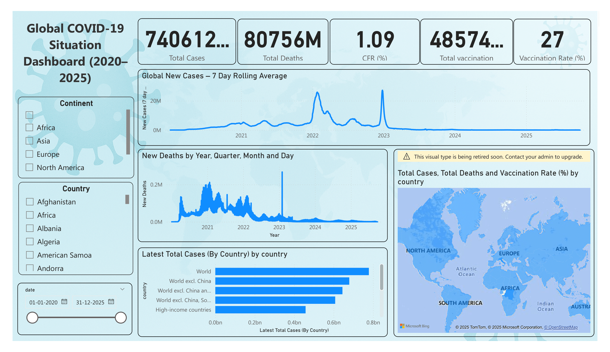
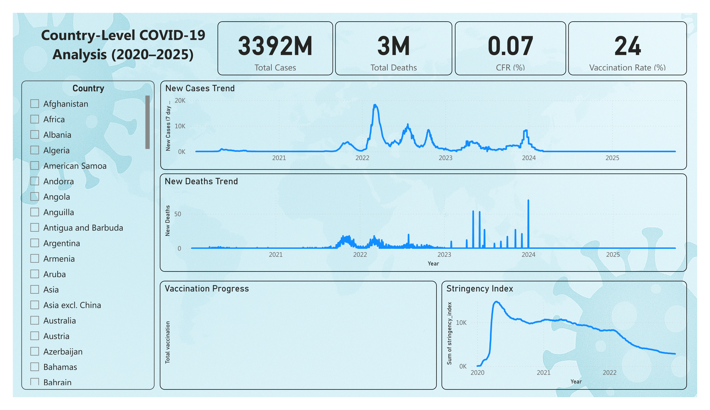
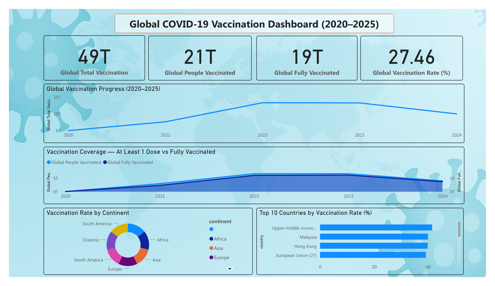

<h1 align="center">👋 Hey, I'm Ganesh Kondamwar</h1>
<h3 align="center">Data Analyst | Power BI | SQL | Python | Excel | BI Enthusiast</h3>

  
  
  

---

## 🚀 About Me

I am a passionate **Data Analyst & Business Intelligence student** who loves converting raw datasets into powerful insights.  
Currently exploring **Power BI, DAX, SQL optimisation, Python automation**, and creating analytics dashboards that tell a story.

- 🔭 **Current Internship:** Data Visualization Intern – Infosys Springboard (ElectViz: Election Data Dashboard)  
- 🌱 Learning: **Advanced DAX, Data Modelling, Python + Pandas**  
- 💡 Interested in: BI, Analytics, Data Engineering, and Automation  
- 📫 Contact me: **ganeshkondamwar2025@gmail.com**

---

## 🛠️ Tech Stack & Tools

**Languages:**  
`Python` • `SQL` • `HTML` • `CSS`  

**Data Tools:**  
`Power BI` • `Excel` (Advanced) • `DAX`  

**Databases:**  
`MySQL`

**Other Skills:**  
`Git` • `GitHub` • `Data Cleaning` • `ETL` • `EDA` • `Dashboard Building`

---

## 📌 Featured Projects

### 🔹 1. **CareVista Hospital Dashboard (Power BI)**
A fully interactive healthcare BI dashboard analyzing patient records, billing, bed occupancy, doctor feedback, and diagnosis trends.  
- End-to-end BI workflow  
- Data cleaning, transformation  
- Star schema modelling & DAX  
- KPI visuals + insights  

📂 Repo: **https://github.com/Ganesh30052003/CareVista-Dashboard**

---

### 🔹 2. **Walmart Sales Analysis — SQL + Python + Power BI**
A complete sales analytics project with SQL queries, Python EDA and Power BI dashboards.  
- Sales forecasting  
- Trend analysis  
- Category insights  
- Data modelling for BI  

📂 Repo: **https://github.com/Ganesh30052003/Walmart-SQL-Analysis.git**

---

### 🔹 3. **ElectViz — Election Data Visualization (Infosys Springboard Internship)**
A media-focused election analysis dashboard built for 2026 reporting.  
- Multi-year election dataset  
- Power BI visual storytelling  
- KPI cards + geospatial maps  
- Star schema modelling  

📂 Repo: **https://github.com/Ganesh30052003/Info_Springboard_internship.git***

---

## 📸 Dashboard Previews

> These are some sample Dashboard Preview :

  

  

  

---

## 📊 GitHub Stats

  
  

---

## 🤝 Connect With Me

---

### ⭐ If you like my work, feel free to star ⭐ my repositories!

